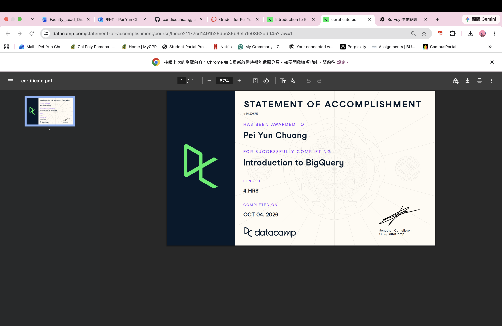

# Introduction

This report documents my learning from the DataCamp course **Introduction to BigQuery**. The course introduced me to how BigQuery is designed for analyzing large datasets in the cloud and how SQL can be used to query, join, manipulate, and optimize data in BigQuery.

Through the course exercises, I practiced BigQuery SQL using e-commerce datasets. I learned how BigQuery differs from a traditional SQL database, how to work with nested data, how to use window functions and joins, and how to improve query efficiency. These skills can be useful for digital marketing analytics because marketing datasets can contain large amounts of customer, transaction, website, and campaign data.

# Certificate of Completion

I completed the DataCamp **Introduction to BigQuery** course.

{width=80%}

# Learning Notes and Key Takeaways

## Introduction to BigQuery

One of my first takeaways was understanding why BigQuery is useful for analytical work. BigQuery is designed to process large datasets and analytical queries. An important characteristic is the separation of storage and compute resources, which allows large amounts of data to be analyzed efficiently.

I also learned that BigQuery is different from a traditional transactional SQL database. A traditional database may be more appropriate for applications that constantly insert or update individual transactions, while BigQuery is especially useful when the goal is to analyze large datasets.

A basic BigQuery query still uses familiar SQL syntax. For example:

```sql
SELECT *
FROM ecommerce.ecomm_order_details
LIMIT 3;
```

This query returns all columns but limits the output to three rows. `LIMIT` is useful when I only want to inspect a small sample of a large dataset.

## Querying Data in BigQuery

This part of the course showed me that BigQuery supports familiar SQL operations but also provides features that are especially useful when working with analytical data.

### Nested and Repeated Data

One important BigQuery concept was working with nested data. BigQuery can store repeated information inside a record. Instead of always separating information into multiple traditional tables, some related values can exist inside nested or repeated fields.

To analyze repeated data, I learned to use `UNNEST()`.

For example:

```sql
SELECT
  o.order_id,
  item.price
FROM ecommerce.ecomm_orders o
CROSS JOIN UNNEST(o.order_items) AS item;
```

`UNNEST()` expands the repeated `order_items` data so that the individual items can be queried. This was one of the BigQuery-specific concepts that was different from the basic SQL skills I learned previously.

### Window Functions

I also practiced window functions. Window functions allow calculations across related rows without reducing the results into one row per group.

For example, a rolling average can be calculated using:

```sql
AVG(price) OVER (
  ORDER BY order_purchase_timestamp
  ROWS BETWEEN 9 PRECEDING AND CURRENT ROW
)
```

This calculates an average using the current row and the previous nine rows.

I learned that BigQuery also provides the `QUALIFY` clause, which can filter the results of a window function.

For example:

```sql
QUALIFY rolling_avg > 500
```

This is useful because the result of a window function can be filtered directly after it is calculated.

For digital marketing, window functions could be useful for examining moving averages in website traffic, conversions, sales, or campaign performance over time.

# Joining Data in BigQuery

Another major part of the course focused on joining tables.

## INNER JOIN

An `INNER JOIN` returns only records that satisfy the join condition in both tables.

This is useful when I only want records that have matching information in both datasets.

## LEFT JOIN

A `LEFT JOIN` keeps all records from the table on the left side of the join, even when a matching record does not exist in the other table.

Example:

```sql
SELECT *
FROM orders o
LEFT JOIN products p
ON p.product_id = o.product_id;
```

This could be useful when I want to keep every order even if some product information is missing.

## RIGHT JOIN

A `RIGHT JOIN` keeps all records from the table on the right side of the join.

This can be useful when the right-side table contains the complete set of records that I need to preserve.

## FULL OUTER JOIN

A `FULL OUTER JOIN` keeps matching and nonmatching records from both tables.

This can be useful when comparing two datasets and identifying records that may exist in only one of them.

## CROSS JOIN and UNNEST

I also practiced using a `CROSS JOIN` with `UNNEST()`:

```sql
SELECT
  o.order_id,
  item.price
FROM ecommerce.ecomm_orders o
CROSS JOIN UNNEST(o.order_items) item;
```

This expands nested values from the `order_items` field and connects them to the original order.

## Joins with Aggregations

Joins can also be combined with aggregate functions.

For example:

```sql
WITH orders AS (
  SELECT
    o.order_id,
    item.product_id
  FROM ecommerce.ecomm_orders o,
  UNNEST(o.order_items) item
)

SELECT
  p.product_id,
  COUNT(o.order_id)
FROM orders o
JOIN ecommerce.ecomm_products p
  ON p.product_id = o.product_id
GROUP BY p.product_id;
```

This type of query can be used to calculate the number of orders associated with each product.

In a marketing context, the same idea could be used to connect customers, products, transactions, campaigns, or website behavior before calculating performance metrics.

# Data Manipulation

The course also introduced Data Manipulation Language (DML).

Important DML statements included:

- `INSERT`
- `UPDATE`
- `DELETE`
- `MERGE`

`INSERT` adds rows to an existing table.

`UPDATE` modifies existing data.

`DELETE` removes rows.

`MERGE` can combine different actions depending on whether records match between datasets.

I learned that conditions are especially important when manipulating data. For example, an `UPDATE` without an appropriate condition could affect more rows than intended.

This helped me understand that SQL is not only used to retrieve data. It can also be used to manage and modify data stored in a database.

# Query Optimization

One of the most useful parts of the course was learning how to make BigQuery queries more efficient.

Because BigQuery may process very large datasets, it is important to avoid querying unnecessary data.

## Select Only Required Columns

Instead of using:

```sql
SELECT *
FROM ecommerce.ecomm_payments;
```

I can select only the columns needed for the analysis:

```sql
SELECT
  order_id,
  payment_type
FROM ecommerce.ecomm_payments
LIMIT 10;
```

This reduces the amount of unnecessary data processed.

## Filtering Data

Filtering data can also reduce the amount of information needed for an analysis.

For example, I practiced identifying orders based on a time period using `TIMESTAMP_SUB()`:

```sql
SELECT
  order_id,
  order_purchase_timestamp
FROM ecommerce.ecomm_order_details
WHERE order_purchase_timestamp <=
      TIMESTAMP_SUB(CURRENT_TIMESTAMP(), INTERVAL 90 DAY);
```

This query identifies orders that occurred at least 90 days before the current timestamp.

## Partitions and Clusters

I learned that table partitions and clusters can improve query performance. They help BigQuery reduce the amount of data that needs to be scanned when a query uses appropriate filtering conditions.

This is especially important for very large datasets where scanning unnecessary data can increase processing time and cost.

## Approximate Functions

BigQuery also provides approximate functions that can be more efficient when an exact result is not required.

One example from the course was:

```sql
APPROX_COUNT_DISTINCT(p.order_id)
```

This provides an approximate count of distinct values and can be useful for large analytical datasets.

# Practical Query Example

One exercise combined several concepts from the course.

```sql
SELECT
  p.payment_installments,
  APPROX_COUNT_DISTINCT(p.order_id),
  AVG(p.payment_value) AS avg_installment_value
FROM ecommerce.ecomm_payments p
JOIN ecommerce.ecomm_order_details o
  USING (order_id)
WHERE p.payment_installments > 0
GROUP BY p.payment_installments;
```

This query combines a join, filtering, grouping, an approximate distinct count, and an average calculation.

The query groups customers or orders according to the number of payment installments and calculates information about payment behavior.

This example helped me see how multiple SQL concepts can be combined to answer a practical business question instead of being used separately.

# Application to Digital Marketing and My CEP

The BigQuery skills from this course can be applied to digital marketing analytics because marketing data often comes from multiple sources.

For my CEP project involving the **PhD Orthodontics website**, BigQuery concepts could support analysis if website or marketing data becomes available.

For example, data could include:

- website visits,
- landing pages,
- consultation actions,
- traffic sources,
- device types,
- campaign information, and
- conversion events.

SQL joins could connect different sources of information, while aggregation could summarize user behavior. Window functions could help analyze changes in website activity or conversions over time.

For my AO1, which focuses on website redesign and user behavior, these techniques could help identify patterns in how users interact with the website and whether specific pages or consultation pathways are associated with stronger engagement.

If GA4 data were exported into BigQuery, SQL could also be used to examine user events and website behavior at a more detailed level. This could support recommendations for improving the consultation journey and website experience.

# Overall Reflection

The most useful concept I learned from this course was how BigQuery extends the SQL skills I learned previously. Basic commands such as `SELECT`, `WHERE`, `JOIN`, and `GROUP BY` are still important, but BigQuery also provides tools for working with large and more complex datasets.

`UNNEST()` was one of the concepts that initially felt different because nested data is not something I focused on in basic SQL. After practicing it, I understood that it allows repeated values inside a record to be expanded so they can be analyzed.

I also found window functions and `QUALIFY` useful. Window functions make it possible to calculate metrics such as rolling averages while keeping individual rows in the result. `QUALIFY` then makes it easier to filter those calculated results.

Another important lesson was query efficiency. Before this course, I mainly focused on whether a query produced the correct answer. This course showed me that I should also think about how much data the query processes. Selecting only required columns, filtering data appropriately, and using partitions, clusters, or approximate functions can make queries more efficient.

For future coursework and my CEP, I think BigQuery could be especially useful when working with GA4, website behavior, customer data, or large marketing datasets. I still need more practice writing complex queries without guidance, especially queries that combine several BigQuery features, but I now understand the main concepts and know which techniques I can review when I need them.

# Appendix

## GitHub Repository

[IBM 6500 SQL Learning Portfolio](https://github.com/candicechuang/ibm-6500-sql-learning-portfolio)

## Published Introduction to BigQuery Report

**Published report URL:**  
*Add the GitHub Pages URL here after the report is rendered and published.*
---
