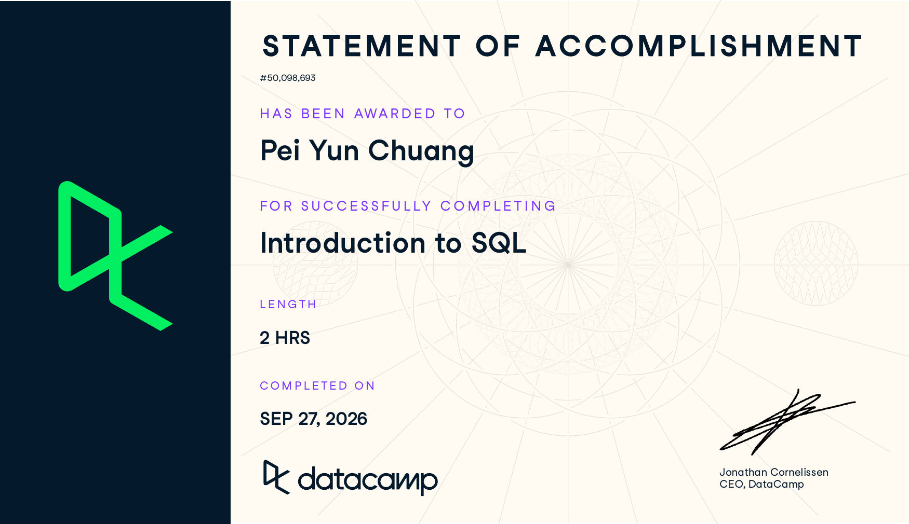

**Course:** IBM 6500  
**DataCamp course:** Introduction to SQL

## Course-Completion Evidence



**Completion date:** September 27, 2026. I completed DataCamp’s Introduction to SQL course on this date.

## Learning Notes and Key Takeaways

### Relational Databases

**Main ideas.** A relational database organizes related information into tables. Each row is one record, and each column describes one attribute. In the course's library example, one row in `books` represents one book. A unique `id` identifies it more reliably than a title, which might be repeated. Separate tables can refer to one another by identifiers. The schema describes the tables and their fields, including data types. Types such as `VARCHAR`, `INT`, and `NUMERIC` matter because names, whole-number identifiers, and decimal prices need different storage and operations. A database server can respond to requests from multiple computers.

**Important SQL syntax.** The chapter introduced table and field names and used `SELECT * FROM books;` to inspect the supplied table. The `*` means all columns; `FROM` identifies the table. Consistent lowercase names with underscores, such as `book_id`, make field names easier to read.

```sql
SELECT *
FROM books;
```

**What this example does.** It displays every field for every book in the `books` table. I would use it to inspect a small sample while learning the table structure; for a large table, I would select only the fields I need.

**CEP application.** If the PhD Orthodontics team receives approved website and consultation data, separate tables could hold page visits and inquiries. A visit ID or inquiry ID would distinguish records, while a documented schema would clarify what each field means. I would check the definitions and privacy rules before using any patient-related information.

### Querying

**Main ideas.** A query asks a database for selected data. `SELECT` chooses fields and `FROM` chooses the table. `DISTINCT` removes duplicate results, while `AS` gives an output column a clearer name. A view saves a query definition so it can be reused. PostgreSQL and SQL Server share core SQL ideas but differ in some syntax: PostgreSQL uses `LIMIT` at the end of a query, whereas SQL Server uses `TOP` after `SELECT`.

**Important SQL syntax.** `SELECT`, `FROM`, `DISTINCT`, `AS`, `CREATE VIEW ... AS`, `LIMIT`, and `TOP` were practiced in this chapter. I use uppercase keywords and lowercase field names to make queries easier to scan; `--` starts a line comment.

```sql
SELECT DISTINCT author AS unique_author
FROM books;
```

**What this example does.** It lists each author once from `books` and labels the resulting column `unique_author`. `DISTINCT` applies to the selected combination of columns: adding `genre` would return unique author–genre pairs rather than one row per author.

```sql
CREATE VIEW library_authors AS
SELECT DISTINCT author AS unique_author
FROM books;

SELECT *
FROM library_authors;
```

**What this example does.** The first statement defines a reusable view, and the second reads its results. A standard view stores the query definition rather than a separate copy of the book records.

```sql
-- PostgreSQL
SELECT genre
FROM books
LIMIT 10;

-- SQL Server equivalent
SELECT TOP (10) genre
FROM books;
```

**What this example does.** Each version requests at most ten genre values. Without `ORDER BY`, the chosen ten rows have no guaranteed order. This is useful for previewing data, not for identifying a definitive top ten.

**CEP application.** With an approved analytics export in a database, I could select page or device fields to inspect the consultation journey, use `DISTINCT` to list the page groups represented, and give fields clear aliases for reporting. A reusable view could present an agreed set of non-sensitive website fields to the team. These examples do not imply that we already have access to such data.

## Overall Reflection and Future Reference

The most useful skill for me was turning a question into a small query: first identify the table, then choose the fields needed. Understanding rows, columns, unique IDs, and data types will also help me check whether a dataset is organized well enough to analyze.

I want more practice with the difference between `DISTINCT` on one field and on a combination of fields, and with how views are created and reused. I also need to remember the `LIMIT` and `TOP` syntax for different SQL systems. For my CEP website analysis, SQL could help organize approved page and inquiry data and make patterns easier to inspect. Any conclusion about why visitors do or do not request a consultation would require more context than a simple query provides.

## Appendix: Publication Links

- [GitHub Repository](https://github.com/candicechuang/ibm-6500-sql-learning-portfolio)
- [Published Introduction to SQL Report](https://candicechuang.github.io/ibm-6500-sql-learning-portfolio/introduction-to-sql.html)

<!-- These URLs are planned locations. Confirm they work after creating the
repository and publishing GitHub Pages from main /docs. -->
